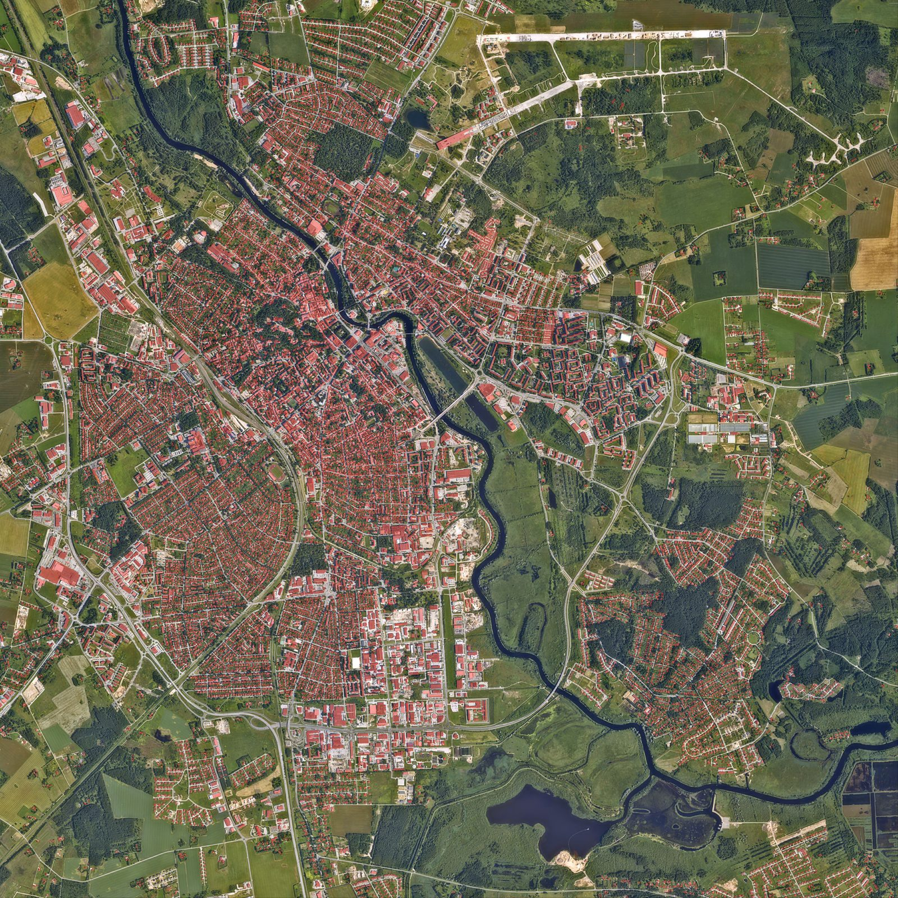
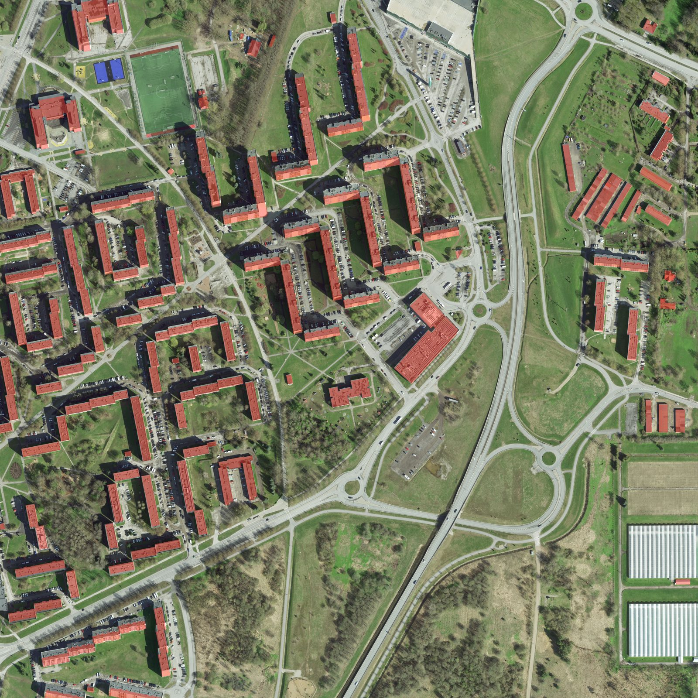

# the-zone-fpv-maps

Maps of real places for the FPV drone simulator [The Zone](https://store.steampowered.com/app/3491280/). One reproducible pipeline turns open geodata into a map file that the game loads. The first maps are of [Tartu](https://en.wikipedia.org/wiki/Tartu), Estonia, built from [Maa- ja Ruumiamet](https://geoportaal.maaruum.ee/) open geodata.

Status: the first test tile loads in the game. The base map of the whole city is built and waits for its first flight. See `docs/the-zone-format.md` for what is verified and what is open.

## Install a map

1. Download the `.glb` file of a map from the [latest release](https://github.com/lightheaded/the-zone-fpv-maps/releases/latest).
2. Open the game folder. In Steam, right click The Zone, then Manage, then Browse local files.
3. Create the folder `custom_maps/<name>/` and put `<name>.glb` in it. The folder name and the file name must be equal. Example: `custom_maps/annelinn-test/annelinn-test.glb`.
4. Start the game, open Play Offline and pick the map from the custom maps.

## Maps

### tartu-base

The whole city at low fidelity, 9 x 9 km and 81 km². Terrain from the 1 m elevation model on a 10 m grid, the 20 cm orthophoto of July 2025 as ground texture at 1.1 m per pixel, and 23,745 LOD2 buildings from five municipalities. The spawn point is on the [Emajõgi](https://et.wikipedia.org/wiki/Emaj%C3%B5gi) between the [Kaarsild](https://et.wikipedia.org/wiki/Kaarsild) and the Võidu sild, and the camera faces north to the old town. The map file is 126 MB and holds 2.87 million triangles in 108 meshes.

Use it for orientation and for long cruises. For freestyle, wait for the detailed maps.



### annelinn-test

1 km² of Annelinn with the west end of Lohkva. Terrain from the 1 m elevation model, the 10 cm orthophoto of April 2024 as ground texture, 145 buildings from the LOD2 data, and test objects near the spawn point. The buildings use the in-game concrete and asphalt textures.




## Build a map yourself

Install [uv](https://docs.astral.sh/uv/) first.

```
uv sync
uv run pytest
uv run fpv-maps build maps/annelinn-test.toml --install
```

The base map downloads 1.6 GB, keeps 2.8 GB on disk, and needs about 3 GB of memory:

```
uv run fpv-maps build maps/tartu-base.toml --install
```

`docs/development.md` explains the setup on macOS, Windows and Linux, native and with Docker.

## Planned products

### Tartu

- Detailed maps of 2 to 6 km² each: `annelinn-lohkva`, `tahtvere-vaksali`, `kesklinn`, `raadi`, and more. For freestyle and rehearsal.
- Trees, power lines, lattice towers, bridges and a water surface for `tartu-base`.

## Documentation

- `docs/analysis.md`: feasibility study and plan for Tartu.
- `docs/the-zone-format.md`: what the game loads, verified facts, open questions.
- `docs/decisions.md`: decision log.
- `docs/development.md`: setup and commands.
- `docs/locations.md`: map tiles and landmarks in Tartu.
- `docs/licensing.md`: license decisions.
- `AGENTS.md`: rules for contributors and coding agents.

## Data and attribution

Geodata: Republic of Estonia Land and Spatial Development Board (Maa- ja Ruumiamet), open data license 2025-01-01, https://geoportaal.maaruum.ee/opendata-licence. Full attribution lines are in `NOTICE`. Every published map carries them. Each build writes the source files and dates to `dist/<name>/build-report.json`.

## Licenses

Code: [Apache-2.0](https://www.apache.org/licenses/LICENSE-2.0) (`LICENSE`). Assets: [CC BY 4.0](https://creativecommons.org/licenses/by/4.0/) (`LICENSE-ASSETS`). Reasoning in `docs/licensing.md`.

## Contributing

See `CONTRIBUTING.md` and `AGENTS.md`. Commits need a [Developer Certificate of Origin](https://developercertificate.org/) sign off.
