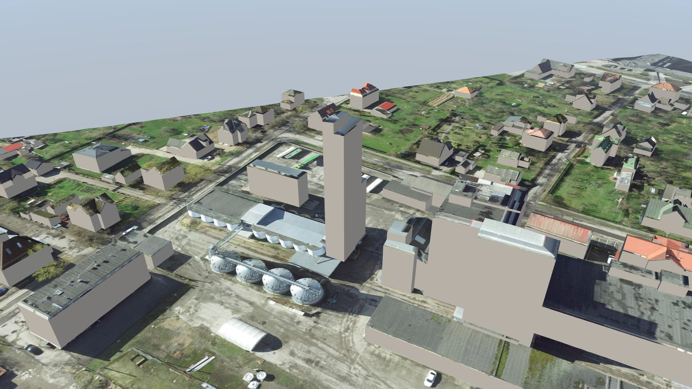
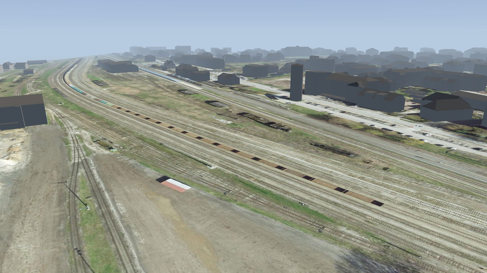
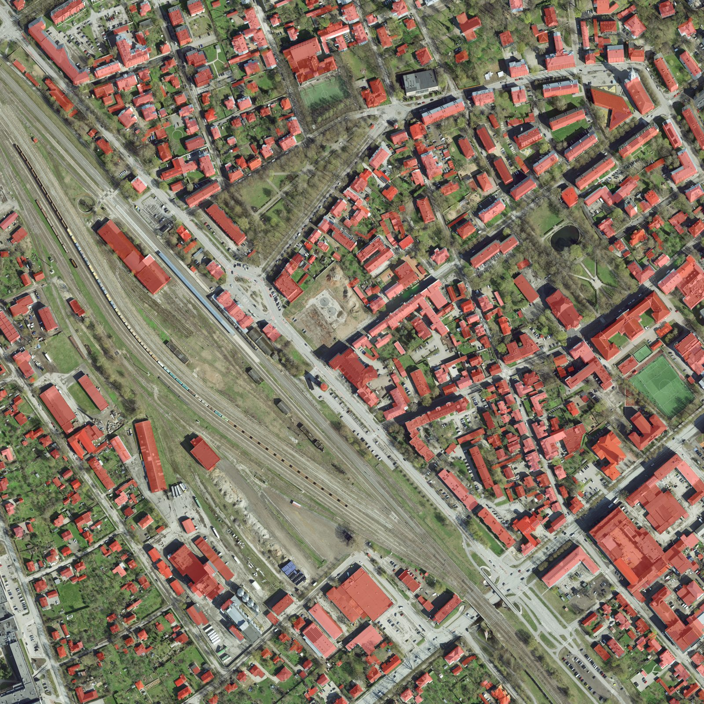
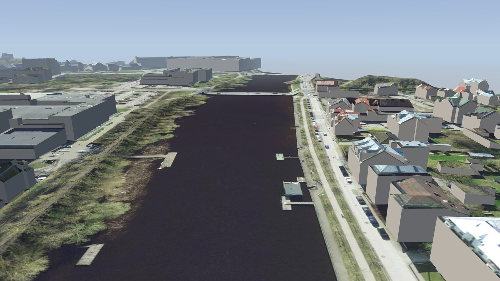
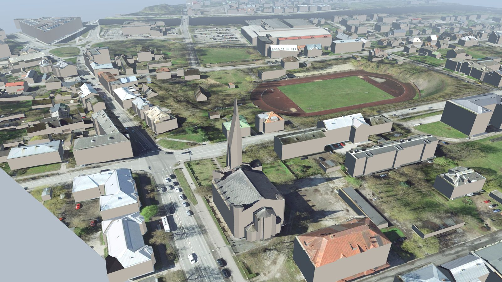
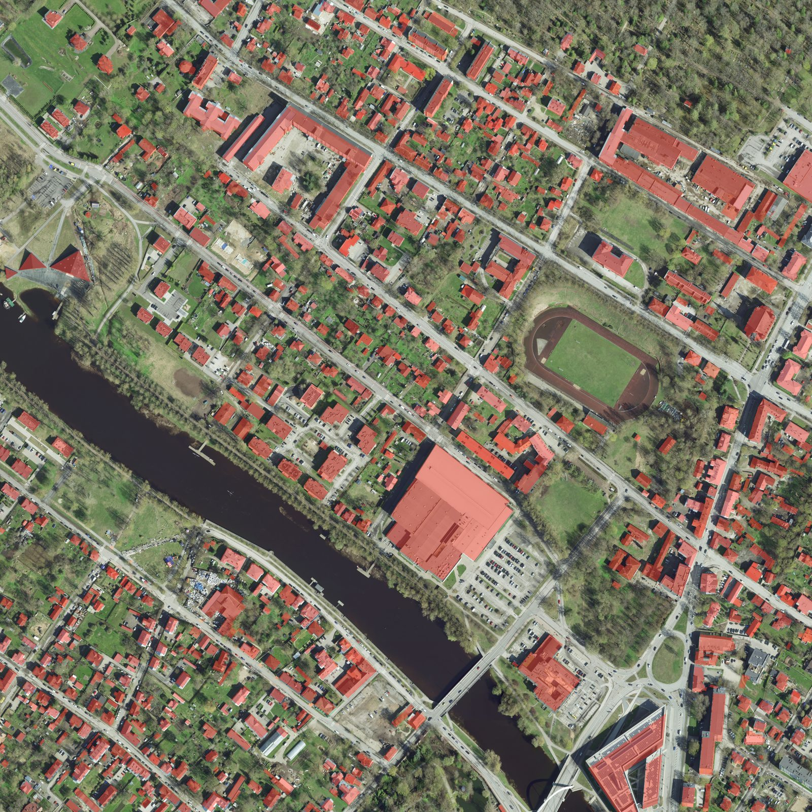
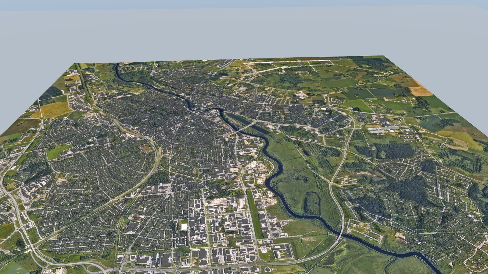
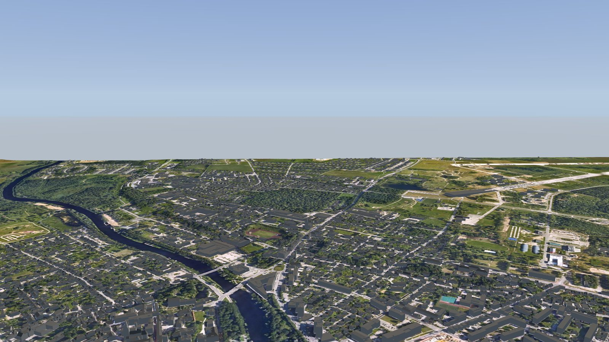
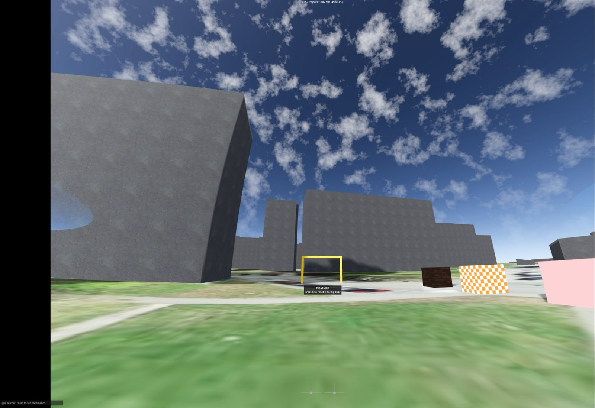
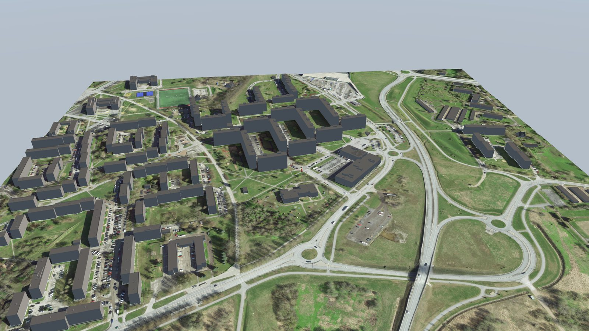

# the-zone-fpv-maps

Maps of real places for the FPV drone simulator [The Zone](https://store.steampowered.com/app/3491280/). One reproducible pipeline turns open geodata into a map file that the game loads. The first maps are of [Tartu](https://en.wikipedia.org/wiki/Tartu), Estonia, built from [Maa- ja Ruumiamet](https://geoportaal.maaruum.ee/) open geodata.

Status: four maps build from the open data, and all four load in the game. The test tile is flown. The base map and the two detailed tiles need a real flight, which measures the frame rate and finds the buildings with a wrong shape. See `docs/the-zone-format.md` for what is verified and what is open, and `docs/maps.md` for the inventory of every map.

## Install a map

1. Download the `.glb` file of a map from the [latest release](https://github.com/lightheaded/the-zone-fpv-maps/releases/latest).
2. Open the game folder. In Steam, right click The Zone, then Manage, then Browse local files.
3. Create the folder `custom_maps/<name>/` and put `<name>.glb` in it. The folder name and the file name must be equal. Example: `custom_maps/tartu-annelinn-test/tartu-annelinn-test.glb`.
4. Start the game, open Play Offline and pick the map from the custom maps.

## Maps

`docs/maps.md` is the inventory. It holds the box, the spawn point, the source data and
the numbers of every map. The [wiki](https://github.com/lightheaded/the-zone-fpv-maps/wiki) is the picture house: every map has a page
there with its whole camera tour, and the tour video is an asset of the newest release.

A tour picture is rendered from the map file, not captured in the game. The geometry,
the ground texture and the spawn point are the true ones, but there is no shadow and no
in-game material. A picture that says "in the game" comes from a person who flew the
map.

### tartu-vaksali

1 km² of the Tartu industry belt at 12 cm per pixel, over Ropka, Karlova and Vaksali. It holds the [Tartu Mill](https://tartumill.ee/) grain elevator with its 49 m tower, the railway station with its freight yard, [Aparaaditehas](https://aparaaditehas.ee/), the 35 m veetorn and Pauluse kirik. 776 buildings from the LOD2 data. The drone spawns in the open freight yard, 121 m from the nearest building.

Every landmark of this tile stands on public ground, so a person can photograph the walls without a permit. It is the first candidate for photo facades.



*The Tartu Mill elevator, 48.6 m above the terrain, beside its silos.*



*The freight yard at the spawn point, with the rails and the wagons of the orthophoto.*



*The whole tile from above, with every roof marked red.*

More pictures and the tour video: the [`tartu-vaksali` wiki page](https://github.com/lightheaded/the-zone-fpv-maps/wiki/tartu-vaksali).

### tartu-ulejoe

1 km² of [Ülejõe](https://et.wikipedia.org/wiki/%C3%9Clej%C3%B5e) at 12 cm per pixel. It holds the old factory wings around a courtyard at Puiestee 13b, the [Tartu](https://en.wikipedia.org/wiki/Tartu) Ülikooli staadion, [Lodjakoda](https://lodi.ee/), the two spires of Peetri kirik at 59 m, and the [Emajõgi](https://et.wikipedia.org/wiki/Emaj%C3%B5gi) between two bridges. 883 buildings from the LOD2 data. The drone spawns on the water, 89 m from the Kroonuaia sild and 89 m from the Vabadussild.



*The camera flies down the Emajogi toward the spawn point.*



*Peetri kirik, the tallest structure of the tile at 59.1 m.*



*The whole tile from above, with every roof marked red.*

More pictures and the tour video: the [`tartu-ulejoe` wiki page](https://github.com/lightheaded/the-zone-fpv-maps/wiki/tartu-ulejoe).

### tartu

The whole city at low fidelity, 9 x 9 km and 81 km². Terrain from the 1 m elevation model on a 10 m grid, the 20 cm orthophoto of July 2025 as ground texture at 1.1 m per pixel, and 23,745 LOD2 buildings from five municipalities. The spawn point is on the [Emajõgi](https://et.wikipedia.org/wiki/Emaj%C3%B5gi) between the [Kaarsild](https://et.wikipedia.org/wiki/Kaarsild) and the Võidu sild, and the camera faces north to the old town. The map file is 126 MB and holds 2.87 million triangles in 108 meshes.

Use it for orientation and for long cruises. For freestyle, wait for the detailed maps.



*The whole 9 x 9 km tile from 3.4 km.*



*A cruise over the city at 620 m, with the Emajogi below.*

More pictures and the tour video: the [`tartu` wiki page](https://github.com/lightheaded/the-zone-fpv-maps/wiki/tartu).

### tartu-annelinn-test

1 km² of Annelinn with the west end of Lohkva. Terrain from the 1 m elevation model, the 10 cm orthophoto of April 2024 as ground texture, 145 buildings from the LOD2 data, and test objects near the spawn point. The buildings use the in-game concrete and asphalt textures.



*In the game, on the first flight of 2026-09-11.*



*The panel houses of Annelinn, from the rendered tour.*


*The whole tile from above, with every roof marked red.*

More pictures and the tour video: the [`tartu-annelinn-test` wiki page](https://github.com/lightheaded/the-zone-fpv-maps/wiki/tartu-annelinn-test).

## Build a map yourself

Install [uv](https://docs.astral.sh/uv/) first.

```
uv sync
uv run pytest
uv run fpv-maps build maps/tartu-annelinn-test.toml --install
```

The base map downloads 1.6 GB, keeps 2.8 GB on disk, and needs about 3 GB of memory:

```
uv run fpv-maps build maps/tartu.toml --install
```

Render the tour of a map, as pictures and as a video. The renderer is an extra,
because [moderngl](https://moderngl.readthedocs.io/) needs a C++ compiler on Linux and Windows:

```
uv sync --extra tour
uv run fpv-maps tour maps/tartu-vaksali.toml --publish
```

`docs/development.md` explains the setup on macOS, Windows and Linux, native and with Docker.

## Planned products

### Tartu

- More detailed tiles of 1 km²: `annelinn-lohkva`, `tahtvere`, `kesklinn`, `raadi`. For freestyle and rehearsal.
- Photo facades on the walls. The pipeline builds them today from the Maa- ja Ruumiamet oblique photos, and `docs/facades.md` describes every step. The maps it makes are not published: the photos are not licensed for redistribution until the access request in `docs/licensing.md` D6 is answered.
- Trees, power lines, lattice towers, bridges and a water surface. A map built straight from the lidar has all of these already, because they were in the beam. See `docs/lidar.md`.
- Hand made hero assets: the silos of Tartu Mill, the church spires, the laululava and the telemast.

## Documentation

- `docs/analysis.md`: feasibility study and plan for Tartu.
- `docs/facades.md`: how a wall gets a photo of itself from an oblique aerial frame.
- `docs/lidar.md`: a map whose whole world is the laser scan, trees and all.
- `docs/the-zone-format.md`: what the game loads, verified facts, open questions.
- `docs/decisions.md`: decision log.
- `docs/development.md`: setup and commands.
- `docs/maps.md`: the inventory of every map.
- `docs/locations.md`: map tiles and landmarks in Tartu.
- `docs/licensing.md`: license decisions.
- `AGENTS.md`: rules for contributors and coding agents.

## Data and attribution

Geodata: Republic of Estonia Land and Spatial Development Board (Maa- ja Ruumiamet), open data license 2025-01-01, https://geoportaal.maaruum.ee/opendata-licence. Full attribution lines are in `NOTICE`. Every published map carries them. Each build writes the source files and dates to `dist/<name>/build-report.json`.

## Licenses

Code: [Apache-2.0](https://www.apache.org/licenses/LICENSE-2.0) (`LICENSE`). Assets: [CC BY 4.0](https://creativecommons.org/licenses/by/4.0/) (`LICENSE-ASSETS`). Reasoning in `docs/licensing.md`.

## Contributing

See `CONTRIBUTING.md` and `AGENTS.md`. Commits need a [Developer Certificate of Origin](https://developercertificate.org/) sign off.
