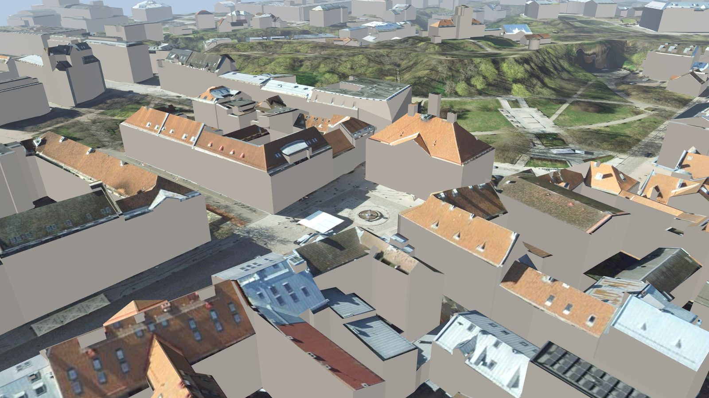
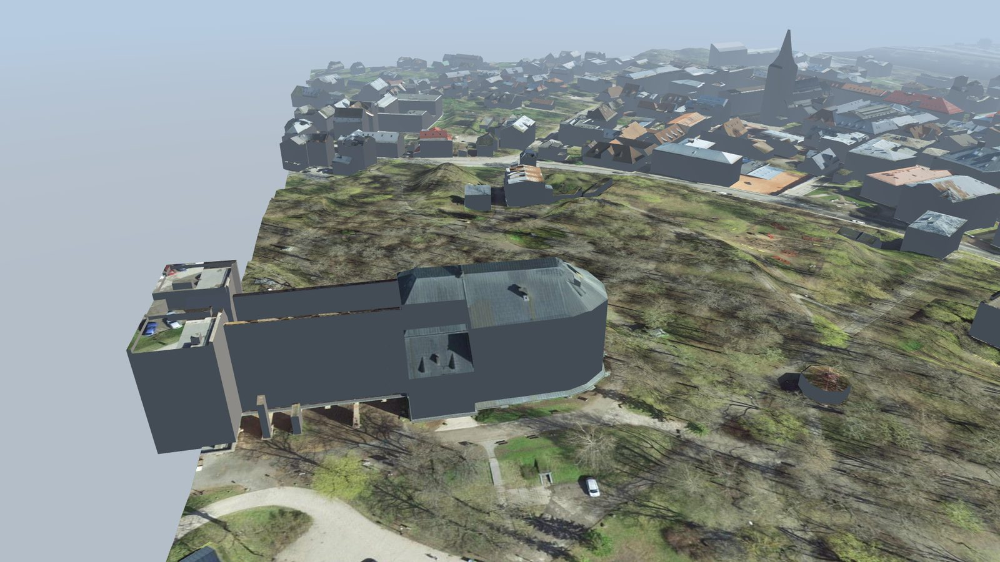
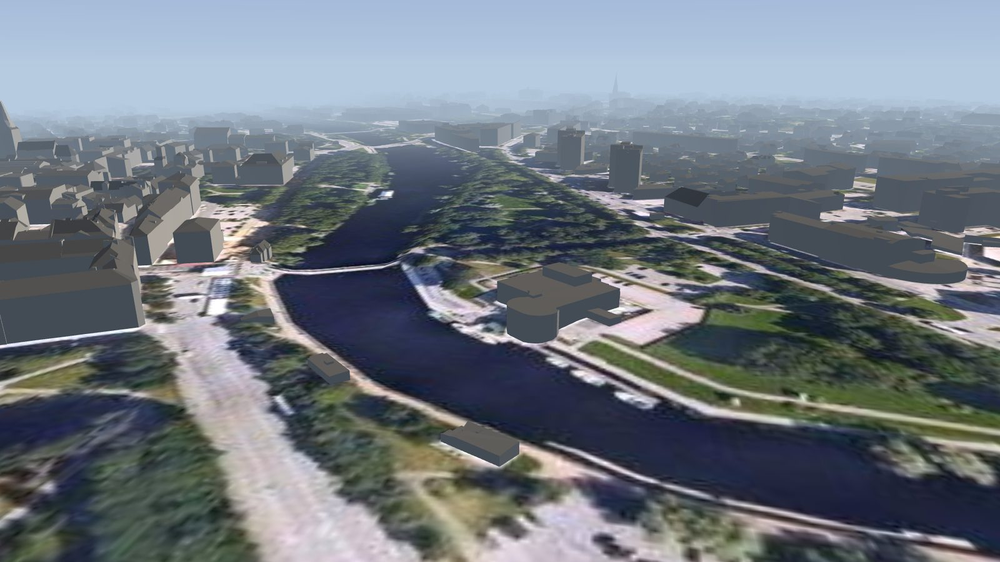
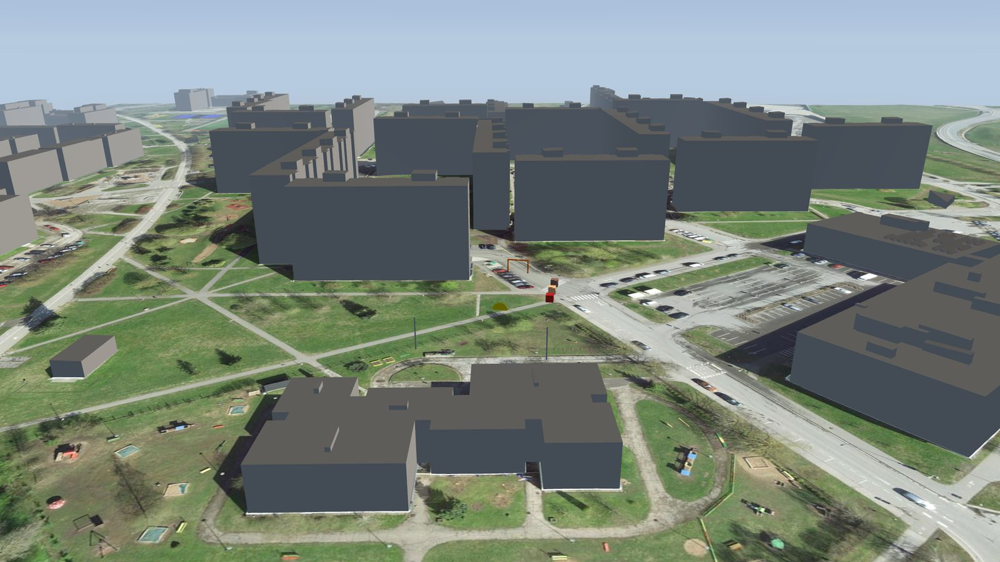

# The maps

Every map that this repository builds. This file is the inventory. A release page names
only the maps that the release adds, so read this file for the full list. Every release
attaches every map, so the newest release always holds them all.

Every map name starts with its city since version 0.4.0. The releases v0.1.0 to v0.3.0
hold the same maps under the names `vaksali`, `ulejoe`, `tartu-base` and
`annelinn-test`. The folder in the game must carry the new name, so an installed map
from an older release needs a new folder. See `docs/decisions.md`.

The numbers come from the build reports of version 0.5.0, built on 2026-09-13 on Linux
x86_64. A build on another processor architecture writes a file of a slightly different
size, because the JPEG encoder differs. The geometry is the same everywhere. See
`docs/development.md`, "How reproducible a build is".

| Map | Area | Ground pixel | Buildings | Triangles | File | First release |
|-----|------|--------------|-----------|-----------|------|---------------|
| [`tartu-old-town`](#tartu-old-town) | 1 x 1 km | 12.2 cm | 549 | 0.55 M | 26.5 MB | v0.5.0 |
| [`tartu-vaksali`](#tartu-vaksali) | 1 x 1 km | 12.2 cm | 776 | 0.55 M | 26.5 MB | v0.3.0 |
| [`tartu-ulejoe`](#tartu-ulejoe) | 1 x 1 km | 12.2 cm | 883 | 0.54 M | 25.8 MB | v0.3.0 |
| [`tartu`](#tartu) | 9 x 9 km | 1.10 m | 23,745 | 2.87 M | 126 MB | v0.2.0 |
| [`tartu-annelinn-test`](#tartu-annelinn-test) | 1 x 1 km | 12.2 cm | 145 | 0.51 M | 23.1 MB | v0.1.0 |

## The pictures of a map

Every map carries three kinds of picture, and `docs/development.md` says how to make
them.

- The preview is the ground texture from above, with the roofs marked red. The build
  writes it.
- The tour pictures come from `fpv-maps tour`. It flies a camera over the built file
  and renders the frames offline. They show the shape of a map: the geometry, the
  ground texture and the spawn point are the true ones, but there is no shadow, no
  vegetation and no in-game material. Two of them stand in each section below.
- The in-game pictures come from a person who flies the map. The game has no free
  camera, so no script can make them. They are the only picture of the true look.

## What every map holds today

- Terrain from the Maa-amet 1 m elevation model, as one mesh or as a grid of chunks.
- One ground texture, cut from the orthophoto and baked into the file as a JPEG.
- LOD2 buildings with the in-game concrete on the walls. The three 1 km tiles give
  each roof its own picture from the orthophoto, straight down, so a tin roof is red
  and a tile roof is brown. The 9 x 9 km base map keeps the in-game asphalt, because
  its ground texture is 1.1 m per pixel and that is not a roof.
- The walls carry no photo texture. `docs/facades.md` describes a pipeline that can
  put one there, and `docs/licensing.md` D6 says why no such map is published yet.

What no map holds yet: trees, power lines, lattice towers, bridges, a water surface,
hand made hero assets and photo facades on the walls. `README.md` lists them under
planned products. A map built straight from the lidar holds the first four already,
because they were in the beam: see `docs/lidar.md`.

## tartu-old-town

1 km² of the Tartu old town, with Raekoja plats in the middle. The box is not on the
Maa-amet 1:2000 grid, because no sheet aligned box holds the old town core: the square,
Toomemägi with the toomkirik ruin, Jaani kirik, the tähetorn, Kaarsild and Võidu sild.

The spawn point is on Raekoja plats, in the open between the raekoda and the Emajõgi
end of the square. The square is 60 m wide, so the drone starts enclosed on two sides,
which is what an old town flight feels like. Toomemägi rises about 25 m over it, so the
tile uses the 2 m terrain step.

The 549 buildings of this box are fewer than the 776 of `tartu-vaksali`, and they are
the reason the tile exists: most of them are attached to their neighbours in blocks,
around courtyards, along streets a drone can fly down. That is a wall problem rather
than a roof problem, which is what `docs/facades.md` is the work on.

### The tour of `tartu-old-town`

## tartu-vaksali

1 km² of the Tartu industry belt, over Ropka, Karlova and Vaksali. The box is the
Maa-amet 1:2000 sheet 473658, so one orthophoto sheet and one elevation sheet cover it.

- Box, L-EST97 (east, north): 658000 6473000 to 659000 6474000.
- Spawn: 658440 6473320, 63.2 m above sea level, in the open freight yard. The nearest
  building stands 121 m away.
- Landmarks: the [Tartu Mill](https://tartumill.ee/) grain elevator with a 49 m tower,
  the railway station and its freight yard, [Aparaaditehas](https://aparaaditehas.ee/),
  the 35 m veetorn and Pauluse kirik.
- Height: the median building is 6.2 m and 17 buildings pass 20 m.
- Source data: orthophoto sheet 473658 of 2024-04-27, elevation sheet 54752, LOD2
  buildings of Tartu linn, exported 2026-09-05.
- Build: 545,540 triangles, 387,621 vertices, 3 meshes, 3 materials, one JPEG of
  12.2 MB, 26.5 MB in total.
- Status: built, and it loads in the game on 2026-09-11. Nothing else is checked.

### The tour of `tartu-vaksali`

*The Tartu Mill elevator, 48.6 m above the terrain.*

*The spawn point in the open freight yard.*

Every shot of the tour, and the video, are on the [`tartu-vaksali` wiki page](https://github.com/lightheaded/the-zone-fpv-maps/wiki/tartu-vaksali).

Every landmark of this tile stands on public ground, so a person can photograph the
walls without a permit. That is why it is the first candidate for photo facades. See
`docs/decisions.md`.

## tartu-ulejoe

1 km² of [Ülejõe](https://et.wikipedia.org/wiki/%C3%9Clej%C3%B5e) with the
[Emajõgi](https://et.wikipedia.org/wiki/Emaj%C3%B5gi) and the north edge of the old
town bank. The box does not align to the 1:2000 grid, so four orthophoto sheets and two
elevation sheets feed one texture. All four sheets are from the same flight of
2024-04-27, so the ground texture has no color step.

- Box, L-EST97 (east, north): 658600 6474850 to 659600 6475850.
- Spawn: 659228 6474937, on the water, 31.6 m above sea level. The Kroonuaia sild is
  89 m upstream and the Vabadussild 89 m downstream. The nearest building stands 38 m
  away on the south bank.
- Landmarks: the old factory wings around a courtyard at Puiestee 13b, the
  [Tartu](https://en.wikipedia.org/wiki/Tartu) Ülikooli staadion, [Lodjakoda](https://lodi.ee/),
  the two spires of Peetri kirik at 59 m, and the river between two bridges.
- Height: the median building is 5.4 m and 10 buildings pass 20 m.
- Source data: orthophoto sheets 474658, 474659, 475658 and 475659, all of 2024-04-27,
  elevation sheets 54752 and 54754, LOD2 buildings of Tartu linn, exported 2026-09-05.
- Build: 543,465 triangles, 381,396 vertices, 3 meshes, 3 materials, one JPEG of
  11.6 MB, 25.8 MB in total.
- Status: built, and it loads in the game on 2026-09-11. Nothing else is checked.

### The tour of `tartu-ulejoe`

*Peetri kirik, the tallest structure of the tile at 59.1 m.*

*The camera flies down the Emajogi toward the spawn point.*

Every shot of the tour, and the video, are on the [`tartu-ulejoe` wiki page](https://github.com/lightheaded/the-zone-fpv-maps/wiki/tartu-ulejoe).

The bridges are in the orthophoto under the drone, but not in the geometry. A bridge is
not a building, so the LOD2 data has none. Treat the river as open water until the
bridge step exists.

## tartu

The whole city at low fidelity, 9 x 9 km and 81 km². It holds every cluster of
`docs/locations.md` except [Tartu lennujaam](https://www.tartu-airport.ee/).

- Box, L-EST97 (east, north): 656000 6468500 to 665000 6477500.
- Spawn: on the Emajõgi at 58.37990 north, 26.72743 east, 31.4 m above sea level,
  between the [Kaarsild](https://et.wikipedia.org/wiki/Kaarsild) and the Võidu sild.
- Ground texture: the 20 cm Estonia orthophoto of July 2025 at 1.10 m per pixel. The
  10 cm city product needs 90 sheets for this area, the 20 cm product needs 6.
- Terrain: a 10 m grid in 36 chunks of 1.5 km. Buildings are chunked the same way.
- Build: 2.87 million triangles, 108 meshes, 3 materials, one JPEG of 18.9 MB, 126 MB
  in total. 23,745 buildings from five municipalities.
- Status: built and loaded in the game on 2026-09-11. Load time, frame rate, position
  accuracy far from the origin and the chunk seams are still open questions.

### The tour of `tartu`

*The whole 9 x 9 km tile from 3.4 km.*

*The spawn point on the river, between the two bridges.*

Every shot of the tour, and the video, are on the [`tartu` wiki page](https://github.com/lightheaded/the-zone-fpv-maps/wiki/tartu).

Fly it for orientation and for long cruises. For freestyle, use a detailed tile.

## tartu-annelinn-test

The first test tile, 1 km² of [Annelinn](https://et.wikipedia.org/wiki/Annelinn) with
the west end of [Lohkva](https://et.wikipedia.org/wiki/Lohkva). It is the Maa-amet
1:2000 sheet 473662.

- Box, L-EST97 (east, north): 662000 6473000 to 663000 6474000.
- Spawn: the center of the box, 49.9 m above sea level.
- It carries test objects near the spawn point, which answer the questions in
  `docs/the-zone-format.md`. A map for flying does not carry them.
- Source data: orthophoto sheet 473662 of 2024-04-27, elevation sheet 54761, LOD2
  buildings of Tartu linn and Luunja vald.
- Build: 511,216 triangles, 14 meshes, 10 materials, one JPEG and one PNG of 11.3 MB,
  23.1 MB in total. 145 buildings.
- Status: built and flown on 2026-09-11. It proved the textures, the material swap by
  name and the spawn behavior.

### The tour of `tartu-annelinn-test`

*The 1 km2 test tile from above.*

*The spawn point with the probe objects.*

Every shot of the tour, and the video, are on the [`tartu-annelinn-test` wiki page](https://github.com/lightheaded/the-zone-fpv-maps/wiki/tartu-annelinn-test).

It stays in the repository as a probe carrier. Every new question about the game format
gets a probe here first.

## Add a map to this list

1. Build the map and copy `dist/<name>/<name>-preview.jpg` to `docs/screenshots/`.
   Without the preview, the release workflow stops and `uv run pytest` fails.
2. Render the tour: `uv run fpv-maps tour maps/<name>.toml --publish`. Without a tour
   picture the release workflow stops.
3. Add a row to the table above and a section with the same headings as the others.
4. Name the cluster of `docs/locations.md` that the box covers, in that file.
5. The release notes name the new map by themselves, from the git history.
6. After the release, run `scripts/publish-tours.sh <tag>` to upload the tour videos
   and to update the wiki gallery.
